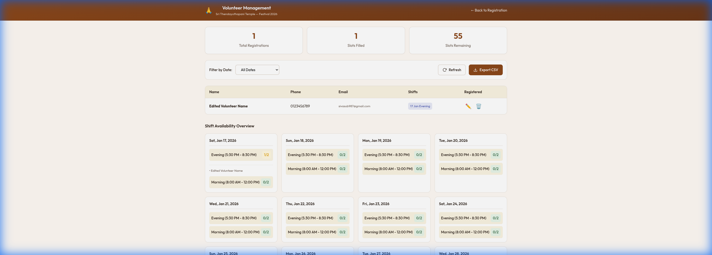
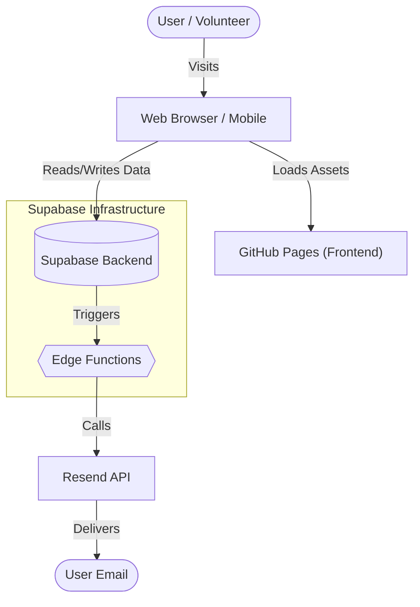

# Volunteer Registration System
**Sri Thendayuthapani Temple — Festival 2026**

A web-based volunteer registration system for managing towel and soap sales shifts during the festival period (17–30 January 2026).

## 🚀 Live Demo
- **Public Registration:** [siva-sub.github.io/volunteer-registration](https://siva-sub.github.io/volunteer-registration/)
- **Admin Dashboard:** [siva-sub.github.io/volunteer-registration/admin/](https://siva-sub.github.io/volunteer-registration/admin/)

## 📸 Screenshots
| Public Registration | Admin Dashboard |
|:---:|:---:|
|  |  |

<p align="center">
  
</p>

## 🏗️ Architecture


## ✨ Features
- **Public Registration:**
  - Simple, mobile-responsive interface.
  - Real-time shift availability (Morning/Evening).
  - Multi-select shifts across different dates.
  - Automatic confirmation emails with shift details.
- **Admin Dashboard:**
  - Secure login (Password protected).
  - View all registrations and slot statuses.
  - Filter by date.
  - Export data to CSV.
  - Send automated reminder emails.
  - Delete/Edit registrations with confirmation.
- **Automated Communication:**
  - Confirmation emails upon registration using Resend.
  - Daily reminder emails sent 1 day before shifts (via Supabase Cron).

## 🛠️ Tech Stack
- **Frontend:** HTML5, CSS3, Vanilla JavaScript, Vite.
- **Backend/Database:** Supabase (PostgreSQL).
- **Email Service:** Resend API via Supabase Edge Functions.
- **Deployment:** GitHub Pages (via GitHub Actions).

## 📦 Setup & Installation

1. **Clone the repository:**
   ```bash
   git clone https://github.com/siva-sub/volunteer-registration.git
   cd volunteer-registration
   ```

2. **Install dependencies:**
   ```bash
   npm install
   ```

3. **Run locally:**
   ```bash
   npm run dev
   ```

4. **Build for production:**
   ```bash
   npm run build
   ```

## 🗄️ Backend Structure
The project relies on a Supabase backend project.
- **Edge Functions:**
  - `send-email`: Triggers transaction emails (confirmation/reminders).
  - `send-reminders`: Cron-job target for daily reminders.
- **Database:**
  - Uses Row Level Security (RLS) and custom Postgres Functions (RPCs) to secure data access.

## 📝 License
This project is created for the Sri Thendayuthapani Temple volunteer coordination.
